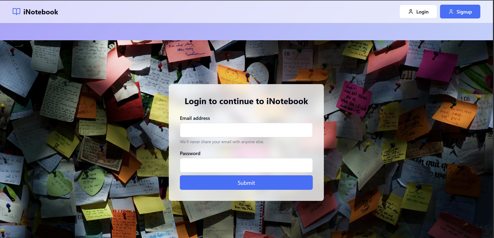
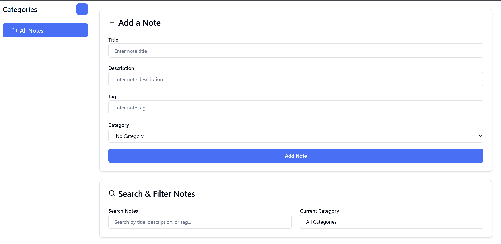
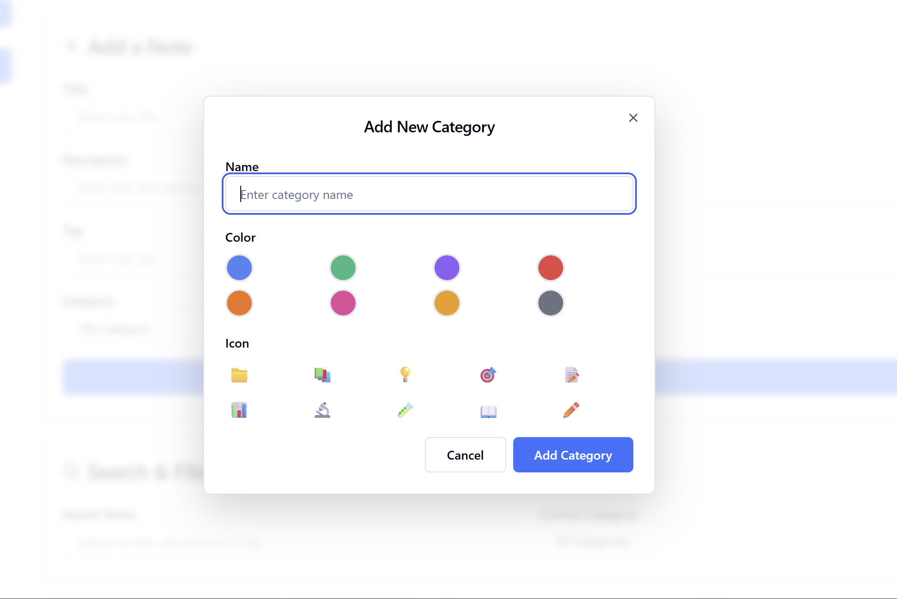

# 📝 NoteMate  
### Secure MERN Note-Making Application

---

## 🌟 About NoteMate

**NoteMate** is a **secure, full-stack note-making application** built using the **MERN stack**.  
It allows users to **organize their thoughts, academic notes, and daily tasks** in a clean and structured way — while ensuring **complete data privacy** through authentication and protected routes.

Each user gets **their own private workspace**, where notes are accessible **only after login**.

---

## 🚀 Key Features

✨ **JWT Authentication & Protected Routes**  
✨ **Create, Edit & Delete Notes (Full CRUD)**  
✨ **Category-Wise Note Organization**  
✨ **Search & Filter Notes Instantly**  
✨ **Private Notes – Accessible Only to Logged-In User**  
✨ **Clean & Responsive UI with Tailwind CSS**

---

## 🧰 Tech Stack

  

| Layer        | Technology |
|--------------|-----------|
| Frontend     | React.js, Tailwind CSS |
| Backend      | Node.js, Express.js |
| Database     | MongoDB |
| Authentication | JWT (JSON Web Token) |

---

## 🔐 Authentication Flow

- Secure **JWT-based authentication**
- Tokens stored safely and validated on every request
- **Protected routes** prevent unauthorized access
- Notes are fetched **user-wise**, ensuring privacy

---

## 📂 Note Categories

Users can organize notes under custom sections like:

- 📘 Operating Systems (OS)
- 🌐 Computer Networks (CN)
- 📝 Daily Tasks
- 🎯 Goals
- ➕ Custom Categories

Category-wise filtering helps users stay organized and productive.

---

## 🖼️ Application Screenshots

### 🔑 Login Page

  

---

### 📝 Add Notes Page

  

---

### 🗂️ Add / Manage Categories

  

---

## 🔍 Search & Filter

- Search notes by **title or content**
- Filter notes **category-wise**
- Instant updates without page reloads

---

## 🔒 Data Privacy & Security

✔ Notes are **linked to user accounts**  
✔ No user can access another user’s notes  
✔ Backend validates JWT on every request  

---

## 📈 Project Highlights

- Well-structured **REST APIs**
- Clean separation of **frontend & backend**
- Scalable database schema
- Responsive UI for all screen sizes

---

## 🎯 Use Cases

- Students managing academic notes
- Daily task tracking
- Goal planning
- Personal knowledge base

---

## 👨‍💻 Author

**Dhruv Garg**  
Prefinal Year Student, NIT Kurukshetra  

---

## ⭐ Show Your Support

If you like this project, consider giving it a ⭐ on GitHub — it really helps!
